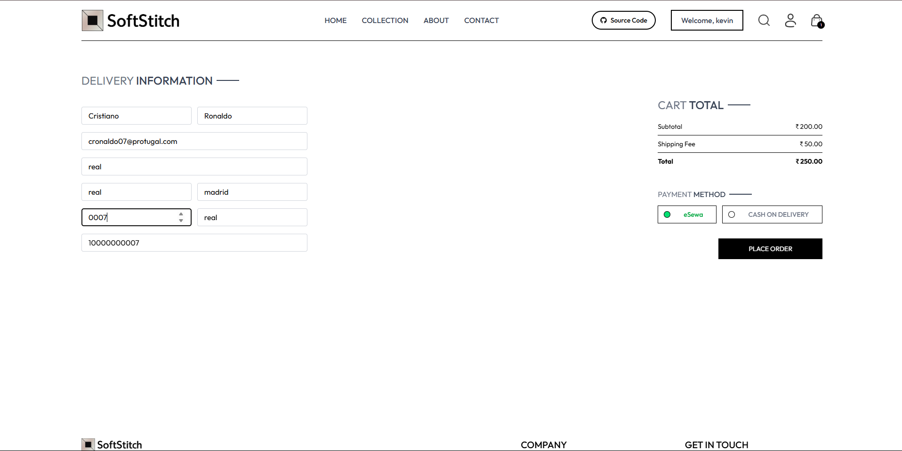

# SoftStitch E-commerce Website

A full-stack e-commerce platform built with React, Node.js,express, and MongoDB, featuring user authentication, product management, shopping cart functionality, and integrated payment gateways.

## 🌟 Features

### Customer Features
- **User Authentication**: Secure login/signup with JWT tokens
- **Product Browsing**: Browse products with search and filtering
- **Shopping Cart**: Add/remove items with size selection
- **Order Management**: Place orders and track order history
- **Payment Integration**: 
  - Cash on Delivery (COD)
  - eSewa payment gateway (Nepal)
- **Responsive Design**: Mobile-friendly interface with Tailwind CSS

### Admin Features
- **Product Management**: Add, edit, and delete products
- **Order Management**: View and update order status
- **User Management**: Monitor user activities
- **Image Upload**: Cloudinary integration for product images

## 🛠️ Tech Stack

### Frontend
- **React 19** - UI framework
- **Vite** - Build tool and dev server
- **Tailwind CSS** - Styling
- **React Router DOM** - Client-side routing
- **Axios** - HTTP client
- **React Hot Toast** - Notifications
- **Framer Motion** - Animations

### Backend
- **Node.js** - Runtime environment
- **Express.js** - Web framework
- **MongoDB** - Database
- **Mongoose** - ODM for MongoDB
- **JWT** - Authentication
- **bcrypt** - Password hashing
- **Multer** - File upload handling
- **Cloudinary** - Image storage

### Payment Integration
- **eSewa** - Digital payment gateway (Nepal)
- **HMAC-SHA256** - Payment signature verification

## 📁 Project Structure

```
SoftStitch-Ecommerce Website/
├── frontend/                 # Customer-facing React app
│   ├── src/
│   │   ├── components/      # Reusable UI components
│   │   ├── pages/          # Page components
│   │   ├── context/        # React context for state management
│   │   └── assets/         # Images and static files
│   └── package.json
├── admin/                   # Admin panel React app
│   ├── src/
│   │   ├── components/     # Admin-specific components
│   │   └── pages/         # Admin pages
│   └── package.json
├── backend/                 # Node.js/Express API server
│   ├── config/            # Database and service configurations
│   ├── controllers/       # Request handlers
│   ├── middleware/        # Authentication and validation
│   ├── models/           # MongoDB schemas
│   ├── routes/           # API routes
│   └── server.js         # Main server file
└── README.md
```

## 🚀 Getting Started

### Prerequisites
- Node.js (v18 or higher)
- MongoDB (local or Atlas)
- npm or yarn package manager

### Installation

1. **Clone the repository**
   ```bash
   git clone https://github.com/AnishGane/SoftStitch---Ecommerce.git
   cd SoftStitch-Ecommerce-Website
   ```

2. **Backend Setup**
   ```bash
   cd backend
   npm install
   ```

3. **Frontend Setup**
   ```bash
   cd ../frontend
   npm install
   ```

4. **Admin Panel Setup**
   ```bash
   cd ../admin
   npm install
   ```

### Environment Variables

Create `.env` files in the backend directory:

```env
# Backend .env
PORT=4000
MONGODB_URI=your_mongodb_connection_string
JWT_SECRET=your_jwt_secret_key
CLOUDINARY_CLOUD_NAME=your_cloudinary_cloud_name
CLOUDINARY_API_KEY=your_cloudinary_api_key
CLOUDINARY_API_SECRET=your_cloudinary_api_secret
ESEWA_SECRET_KEY=your_esewa_secret_key
```

### Running the Application

1. **Start Backend Server**
   ```bash
   cd backend
   npm run server  # Development with nodemon
   # or
   npm start       # Production
   ```

2. **Start Frontend (Customer App)**
   ```bash
   cd frontend
   npm run dev
   ```

3. **Start Admin Panel**
   ```bash
   cd admin
   npm run dev
   ```

The applications will be available at:
- Backend API: `http://localhost:4000`
- Frontend: `http://localhost:5173`
- Admin Panel: `http://localhost:5174`

## 🔧 API Endpoints

### Authentication
- `POST /api/user/register` - User registration
- `POST /api/user/login` - User login
- `POST /api/user/admin/login` - Admin login

### Products
- `GET /api/product/list` - Get all products
- `POST /api/product/add` - Add new product (Admin)
- `PUT /api/product/update/:id` - Update product (Admin)
- `DELETE /api/product/delete/:id` - Delete product (Admin)

### Cart
- `POST /api/cart/add` - Add item to cart
- `POST /api/cart/remove` - Remove item from cart
- `GET /api/cart/list` - Get user's cart

### Orders
- `POST /api/order/place` - Place new order
- `POST /api/order/esewa` - Place order with eSewa payment
- `GET /api/order/user` - Get user's orders
- `GET /api/order/list` - Get all orders (Admin)

### Payment
- `POST /api/esewa/signature` - Generate eSewa payment signature

## 💳 Payment Integration

### eSewa Integration
The application integrates with eSewa payment gateway for digital payments in Nepal:

1. **Payment Flow**:
   - User selects eSewa payment method
   - System generates payment signature
   - User is redirected to eSewa payment page
   - After payment, user is redirected back with success/failure status

2. **Environment Setup**:
   - Set `ESEWA_SECRET_KEY` in backend environment variables
   - Configure eSewa merchant credentials
   - Update product codes for production/development

## 🚀 Deployment

### Backend Deployment (Render)
1. Connect your GitHub repository to Render
2. Set build command: `npm install`
3. Set start command: `npm start`
4. Add environment variables in Render dashboard
5. Deploy

### Frontend Deployment (Render)
1. Connect your GitHub repository to Render
2. Set build command: `npm install && npm run build`
3. Set publish directory: `dist`
4. Add environment variables if needed
5. Deploy

### Environment Variables for Production
```env
# Frontend
VITE_BACKEND_URL=https://your-backend.onrender.com

# Backend
MONGODB_URI=your_mongodb_atlas_uri
JWT_SECRET=your_secure_jwt_secret
CLOUDINARY_CLOUD_NAME=your_cloudinary_cloud_name
CLOUDINARY_API_KEY=your_cloudinary_api_key
CLOUDINARY_API_SECRET=your_cloudinary_api_secret
ESEWA_SECRET_KEY=your_esewa_secret_key
```

## 🔒 Security Features

- **JWT Authentication**: Secure token-based authentication
- **Password Hashing**: bcrypt for password security
- **CORS Protection**: Configured for specific origins
- **Input Validation**: Request validation middleware
- **File Upload Security**: Multer with file type restrictions

## 📱 Responsive Design

The application is fully responsive and optimized for:
- Desktop computers
- Tablets
- Mobile phones

Built with Tailwind CSS for consistent styling across all devices.

## 🤝 Contributing

1. Fork the repository
2. Create a feature branch (`git checkout -b feature/AmazingFeature`)
3. Commit your changes (`git commit -m 'Add some AmazingFeature'`)
4. Push to the branch (`git push origin feature/AmazingFeature`)
5. Open a Pull Request

## 📄 License

This project is licensed under the ISC License.

## 🌐 Live Demo

### Website Links
- **Frontend (Customer App)**: [https://softstitch-ecommerce.onrender.com](https://softstitch-ecommerce.onrender.com)
- **Backend API**: [https://softstitch-backend.onrender.com](https://softstitch-backend.onrender.com)

### Screenshots

#### Customer Pages

*Modern landing page with hero banner and featured products*


*Browse all products with search and filtering*


*Individual product view with size selection and add to cart*


*Cart management with quantity controls and total calculation*


*Order placement with address form and payment options*


*Secure authentication forms*

#### Admin Panel

*Overview of orders, products, and sales*


*Add, edit, and delete products with image upload*


*View and update order status*


*Monitor user activities and data*

## 👨‍💻 Author

**Anish** - Full Stack Developer

## 🙏 Acknowledgments

- eSewa for payment gateway integration
- Cloudinary for image storage
- MongoDB Atlas for database hosting
- Render for deployment platform

## 📞 Support

For support and questions:
- Create an issue in the GitHub repository
- Contact: anishgane10@gmail.com

---

**Note**: This is a production-ready e-commerce platform with all essential features for running an online store. Make sure to configure all environment variables and payment credentials before deployment.
